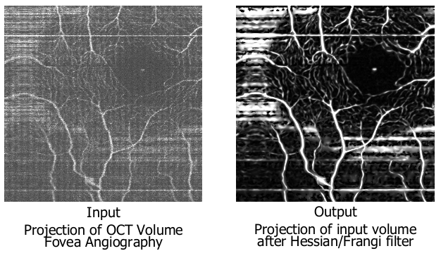

# Enhancing vessels in 3D images with Hessian/Frangi/Eigenvalue filter

	
	
  	
	
	

Based on "Multiscale vessel enhancement filtering" by A.F. Frangi, 1998. <a href="https://link.springer.com/chapter/10.1007/BFb0056195">Link to paper</a>. 
Developed by Viet Than, Medical Image Computing Lab under Ipek Oguz, Vanderbilt University. 2019.

Presentation as [pdf](VISE_August_Presentation_Viet_Than.pdf) or [powerpoint](VISE_August_Presentation_Viet_Than.pptx).
## ITK library
<i>"ITK is an open-source, cross-platform system that provides developers with an extensive suite of software tools for image analysis."</i> 
 - developed by the National Library of Medicine
 
## Hessian filters
There should only be one but was separated into 2 parts, both is needed. One applies the Frangi equation on the eigenvalues extracted from the Hessian information of the image, the other applies the previous to different scale levels. Filters contributed by Luca Antiga of Medical Imaging Unit, Bioengineering Department, Mario Negri Institute, Italy.
 - itkHessianToObjectnessMeasureImageFilter.h
 - itkMultiScaleHessianBasedMeasureImageFilter.h
 
## Some notes on parameters
1. Alpha: corresponding to ratio _R\_A_, "essential for distinguishing between plate-like and line-like structures since only in the latter case it will be zero" - Frangi, 1998
2. Beta: corresponding to ratio _R\_B_, "accounts for the deviation from a blob-like structure but cannot distinguish between a line- and a plate-like pattern" - Frangi, 1998
3. Gamma: correspond to _S_, "the Frobenius norm of the Hessian matrix, or second-order structureness" - comment in source code of itkHessianToObjectnessMeasureImageFilter
4. Sigma: the range of scales being filtered (will need to input sigma minimum, maximum, and number of steps in that range)

## Data example
Smallfield fovea angiography provided by the Diagnostic Imaging and Image-Guided Interventions Lab under Yuankai Tao, Vanderbilt University. 2019.

## Related repositories:

In various state of unfinished to complete:
- [Vasculature Assessment](https://github.com/VietThan/VasculatureAssessment): Scripts for quantitative assesment of (retinal) microvasculature
- [FrangiFilter with MatLab](https://github.com/VietThan/FrangiFilter)
- [Histogram Slice](https://github.com/VietThan/HistogramSlice): Using ITK library to extract individual slice of a volume and histogram match filter it with the middle slice
- [Useful ITK/c3d scripts and commands](https://github.com/VietThan/ITKscripts)

## Author and Acknowledgements
Author: Viet Than, Department of EECS, Vanderbilt University, US. 
Supervisor: Ipek Oguz, Prof. Department of EECS, Vanderbilt University, US.

With the help of the Medical Image Computing Lab.
